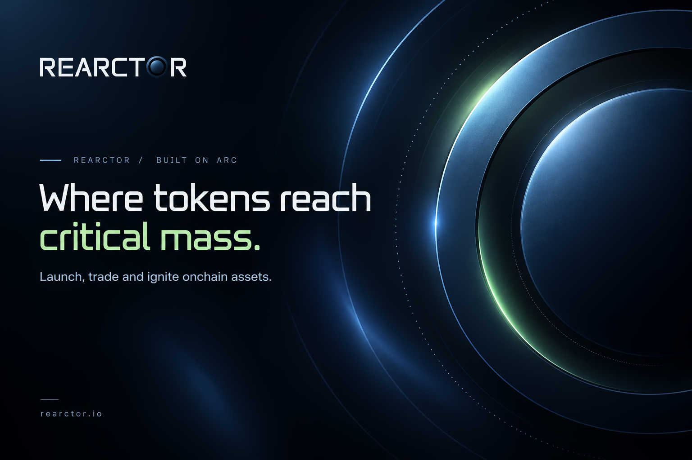

  

**From Spark to Ignition.**

Rearctor is a token launch protocol built for Arc, taking onchain assets from
deployment and USDC price discovery to critical mass and permanent
Uniswap V4 liquidity.

---

## The reaction lifecycle

Every launch is a **reaction**.

**Spark → Charging → Critical Mass → Ignition → Expansion**

| Stage | |
| :--- | :--- |
| **Spark** | A reaction is deployed with a fixed initial supply of 1,000,000,000 tokens. |
| **Charging** | Price discovery runs on a USDC-denominated bonding curve. |
| **Critical Mass** | The curve accumulates **5,042 USDC**. There is no early graduation. |
| **Ignition** | Graduation and liquidity migration execute atomically. At least 20% of supply migrates into full-range Uniswap V4 liquidity. |
| **Expansion** | Migrated liquidity is permanent. Fee generation continues. |

---

## Protocol mechanics

| | |
| :--- | :--- |
| Chain | Arc |
| Initial supply | 1,000,000,000 - fixed |
| Market denomination | USDC |
| Trading fees | 1%–10%, set at launch, immutable thereafter |
| Fee distribution | 30% protocol · 70% reaction |
| Ignition threshold | 5,042 USDC |
| Migration | Atomic · full-range Uniswap V4 · ≥ 20% of supply |
| Liquidity | Permanent - no principal withdrawal function |
| Transfers | Wallet-to-wallet transfers are untaxed |

---

## REARC

**REARC** is the Rearctor protocol token.

---

## Explore

[Website](https://rearctor.io) · [Docs](https://rearctor.io/docs) · [X](https://x.com/JoinRearctor) · [Telegram](https://t.me/rearctor)

---

**Every reaction begins with a spark.**

